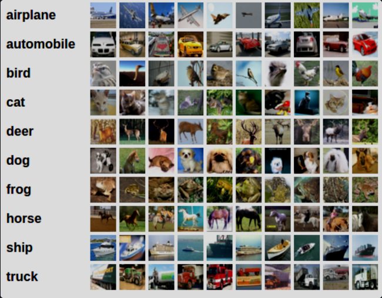
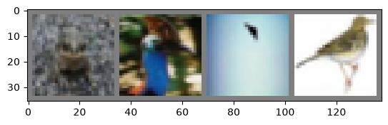
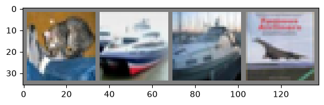

就是这样。你已经了解了如何定义神经网络、计算损失以及更新网络权重。

现在你可能在想，

## 一.数据该怎么办？
通常，当你需要处理图像、文本、音频或视频数据时，可以使用标准的 Python 库将数据加载到 numpy 数组中。然后，你可以将这个数组转换为 `torch.*Tensor`。

- 对于图像，Pillow、OpenCV 等包很有用
- 对于音频，scipy 和 librosa 等包很有用
- 对于文本，使用原生 Python 或基于 Cython 的加载方式，或者 NLTK 和 SpaCy 很有用

专门针对视觉任务，我们创建了一个名为 `torchvision` 的包，其中包含了针对常用数据集（如 ImageNet、CIFAR10、MNIST 等）的数据加载器，以及用于图像的数据转换工具，即 `torchvision.datasets` 和 `torch.utils.data.DataLoader`。

这提供了极大的便利，避免了编写模板代码。

在本教程中，我们将使用 CIFAR10 数据集。它包含以下类别：‘飞机’、‘汽车’、‘鸟’、‘猫’、‘鹿’、‘狗’、‘青蛙’、‘马’、‘船’、‘卡车’。CIFAR-10 中的图像尺寸为 3x32x32，即 32x32 像素的 3 通道彩色图像。

<div style="text-align:center;font-size:0.95em;color:pink;">卷积神经网络</div>

## 二.训练图像分类器
我们将按顺序执行以下步骤

1. 使用 `torchvision` 加载并归一化 CIFAR10 训练集和测试集
2. 定义卷积神经网络
3. 定义损失函数
4. 在训练数据上训练网络
5. 在测试数据上测试网络

### 1. 加载并归一化 CIFAR10


```python
import torch
import torchvision
from torchvision.transforms import v2
```

torchvision 数据集输出的是 **0~255 的 uint8 图像**,经 `ToDtype(scale=True)` 变为 **[0,1]** 浮点张量,再经 `Normalize` 变为 **[-1,1]**。

> Attention:
>
> 如果你在 Windows 或 MacOS 上运行本教程并遇到与多进程相关的 BrokenPipeError 或 RuntimeError，请尝试将 torch.utils.data.DataLoader() 的 num_workers 设置为 0。


```python
transform = v2.Compose([
    v2.ToImage(),
    v2.ToDtype(torch.float32, scale=True),
    v2.Normalize((0.5, 0.5, 0.5), (0.5, 0.5, 0.5))])

batch_size = 4

trainset = torchvision.datasets.CIFAR10(root='./data', train=True,
                                        download=True, transform=transform)
trainloader = torch.utils.data.DataLoader(trainset, batch_size=batch_size,
                                          shuffle=True, num_workers=2)

testset = torchvision.datasets.CIFAR10(root='./data', train=False,
                                       download=True, transform=transform)
testloader = torch.utils.data.DataLoader(testset, batch_size=batch_size,
                                         shuffle=False, num_workers=2)

classes = ('plane', 'car', 'bird', 'cat',
           'deer', 'dog', 'frog', 'horse', 'ship', 'truck')
```

    G:\anaconda envs\envs\deep_learning_begin\Lib\site-packages\torchvision\datasets\cifar.py:83: VisibleDeprecationWarning: dtype(): align should be passed as Python or NumPy boolean but got `align=0`. Did you mean to pass a tuple to create a subarray type? (Deprecated NumPy 2.4)
      entry = pickle.load(f, encoding="latin1")
    

### Question {1}:

- 1. Q1:为什么这里会弹出警告?

     因为torchvision 没跟上 numpy 2.4 , 这里传值(`align`)要求是布尔类型, 但是实际传入了0. <br>
     > 1. **`VisibleDeprecationWarning`** —— 警告的类型。`DeprecationWarning` 的意思是"这个用法现在还能用,但**将来某个版本会被删掉**"。`Visible`(可见)是 numpy 加的一个子类,意思是"这警告我就是要让你看见".<br>
     > 2. **`cifar.py:83`** —— 出问题的地方是 torchvision 的 `cifar.py`,不是你的代码。<br>
     > 3. **内容**:`dtype(): align should be passed as Python or NumPy boolean but got align=0 (Deprecated NumPy 2.4)` —— numpy 2.4 把"传给 `align` 的必须是布尔值"这条规则变严了,而 torchvision 传的是整数 `0`。<br>

     此警告可以忽略, 不影响后续使用.


```python
import matplotlib.pyplot as plt
import numpy as np

# functions to show an image (用于展示图片的函数)


def imshow(img):
    img = img / 2 + 0.5     # unnormalize (反归一化) #什么是归一化?干嘛要反?
    npimg = img.numpy()     #npimg是什么参数?
    plt.imshow(np.transpose(npimg, (1, 2, 0))) #imshow应该是展示前准备?这一步可能是在做图像位置调整?
    plt.show()


# get some random training images (获取一些随机的训练图像)
dataiter = iter(trainloader) #iter是指针吗?
images, labels = next(dataiter) #next是个什么东西?链表吗,好奇怪.

# show images (展示图片)
imshow(torchvision.utils.make_grid(images)) #看不懂里面的属性和方法
# print labels (打印标签)
print(' '.join(f'{classes[labels[j]]:5s}' for j in range(batch_size))) #直到这一步才知道要打印几张图片的标签,那前面怎么知道要打印几张图片呢?
```


    

    


    frog  bird  plane bird 
    

### Question {2}:

- 1. Q1:`def imshow()`中为何要先进行*unnormalize(反归一化)*?

     - 我们先来看看归一化是在哪里进行的, 以及为什么要归一化:<br>
     
       在上个代码块中有:<br>
       ````python
       transform = v2.Compose([
           v2.ToImage(),
           v2.ToDtype(torch.float32, scale=True), # 第1步: 0~255 的整数图像 -> 0~1 的张量
           v2.Normalize((0.5, 0.5, 0.5), (0.5, 0.5, 0.5))  # 第2步: (x-0.5)/0.5 -> [-1, 1]
       ])
       ````

       > 归一化原因:<br>
       > - **尺度统一**: 所有RGB像素都在同一量级,优化器好收敛;<br>
       > - **中心化**在 0 附近,数值更稳。<br>

     - 那么为什么这里要反归一化?
       
       >`img / 2 + 0.5` 是它的**反操作**。正向是 `y = 2x - 1`,反函数就是 `x = (y+1)/2 = y/2 + 0.5`。<br>
       >演示里反归一化后回到 **[0, 1]**, 并不是返回至最初的0~255整数.<br>
       >因为 matplotlib 的 `imshow` 按 [0,1] 显示,超出范围的值会被截断,所以**显示前必须把它还回去**,否则图会发黑或发花。<br>
<br>

- 2. Q2:`npimg`是什么参数?

     并非参数,是变量, 逐步拆解:
     
     > 首先我们要知道`def imshow(img)`填入的`img`是张量tensor. <br>
     > 其次需要回忆起张量转numpy的方法是什么: `tensor.numpy()`<br>
     > 所以这里就是把img从张量转为了numpy.<br>
     > *npimg*只是作者取了个名字, 大概是指numpy形式的图片.<br>
<br>

- 3. Q3:`np.transpose(npimg, (1, 2, 0))`是在调整位置吗?

     准确来说, 是在**维度重排**(换轴), 因为matplotlib和torch对图像维度的存储要求不同:

     > - **torch**:图像存成 `(C, H, W)` —— 通道在前(C=3 个通道分开存)。<br>
     > - **matplotlib**:要 `(H, W, C)` —— 每个像素位置要一次性给出 `[R,G,B]` 三个值。<br>

     `transpose` 的参数 `(1, 2, 0)` 是"把原来的第 1 轴挪到第 0 位、第 2 轴挪到第 1 位、第 0 轴挪到第 2 位",即 `(C,H,W) → (H,W,C)`。
<br>

- 4. Q4:`dataiter = iter(trainloader)`, `iter`是指针吗?

     称呼不太准确, 应该叫做迭代器, 和C++中的差不多.<br>
     但是概念相似、实现不同.<br>

     上个代码块中有:
     ````python
     trainloader = torch.utils.data.DataLoader(trainset, batch_size=batch_size,
                                               shuffle=True, num_workers=2)
     ````

     > DataLoader 的本质职责就是"每次吐一个 batch",所以它天然支持 `iter()`/`next()`。<br>
<br>

- 5. Q5:`next(dataiter)`是链表吗?

     `next(迭代器)` 每次返回下一个元素并把书签往后推一格,读尽会抛 `StopIteration`。<br>
     这是 Python 的通用迭代器协议,和链表无关, 但是在概念上是有点相似的. <br>
     这里走一步是取一个`batch_size`, 即4张图片.<br>
<br>

- 6. Q6:`torchvision.utils.make_grid()`这什么属性和方法?

     > - `torchvision.utils`不是属性, 是`torchvision`中的一个工具子模块.<br>
     > 
     > - `make_grid(...)` 是它里面的一个**函数**(类里的函数才叫做方法)<br>
         作用是把一批图拼成一张大图(像照片联系表,图与图之间有 2px 白边)。<br>
<br>   

- 7. Q7:直到最后这一步才知道要打印几张图片的标签,那前面怎么知道要打印几张图片呢?

     结合*Q4*,*Q5*可知:
     > `next`的实际上调用的是迭代器的 __next__,迭代器再向 DataLoader 拉数据<br>
     > 而`dataloader`一次吐出batch_size个图片<br>

     因此, 前面`imshow(torchvision.utils.make_grid(images))`时, 填入的`images`数量自动为`batch_size`
<br>


## 三. 定义卷积神经网络
从之前的“神经网络”章节中复制神经网络代码，并将其修改为接收 3 通道图像（而不是原先定义的 1 通道图像）。


```python
import torch.nn as nn
import torch.nn.functional as F


class Net(nn.Module):
    def __init__(self):
        super().__init__()
        self.conv1 = nn.Conv2d(3, 6, 5)
        self.pool = nn.MaxPool2d(2, 2)
        self.conv2 = nn.Conv2d(6, 16, 5)
        self.fc1 = nn.Linear(16 * 5 * 5, 120)
        self.fc2 = nn.Linear(120, 84)
        self.fc3 = nn.Linear(84, 10)

    def forward(self, x):
        x = self.pool(F.relu(self.conv1(x)))
        x = self.pool(F.relu(self.conv2(x)))
        x = torch.flatten(x, 1) # flatten all dimensions except batch(展平全部维度, 除了批次层)
        x = F.relu(self.fc1(x))
        x = F.relu(self.fc2(x))
        x = self.fc3(x)
        return x


net = Net()
```

### Question {3}:

- 1. Q1:`x = torch.flatten(x, 1)`的注释在说什么?

     在`flatten`之前, 张量x 一直都是4个维度, 分别是(N,C,H,W).
     > - **N**: 批次层, 一批次进入多少张图片
     > - **C**: 通道数
     > - **H**: 张量高度
     > - **W**: 张量宽度

     因此, 要保证批次层的存在, 不能把每一张图片都混在一次了.
<br>


## 四. 定义损失函数和优化器
我们使用分类交叉熵损失函数和带有动量的随机梯度下降（SGD）。


```python
import torch.optim as optim

criterion = nn.CrossEntropyLoss()
optimizer = optim.SGD(net.parameters(), lr=0.001, momentum=0.9)
```

## 五. 训练网络
这是事情变得有趣的地方。我们只需遍历数据迭代器，将输入送入网络并进行优化即可。


```python
for epoch in range(2):  # loop over the dataset multiple times(在数据集上多次循环)

    running_loss = 0.0 #running_loss应该只是一个统计量,作者为了我们方便观察运行时状态而设置的?
    for i, data in enumerate(trainloader, 0): #enumerate是个什么函数来着?好像是python自带的?
        # get the inputs; data is a list of [inputs, labels](获取输入;数据是一个[输入,标签]的列表)
        inputs, labels = data

        # zero the parameter gradients(清零参数梯度)
        optimizer.zero_grad()

        # forward + backward + optimize(前向+反向+优化)
        outputs = net(inputs)
        loss = criterion(outputs, labels)
        loss.backward()
        optimizer.step()

        # print statistics(打印统计数据)
        running_loss += loss.item()
        if i % 2000 == 1999:    # print every 2000 mini-batches(每2000迷你批次打印一次) #作者所说的mini-batches是指2000次小批次吧?也就是8000张图片?
            print(f'[{epoch + 1}, {i + 1:5d}] loss: {running_loss / 2000:.3f}') #这里把统计的数据均分到2000个迷你批次上了
            running_loss = 0.0

print('Finished Training')
```

    [1,  2000] loss: 2.174
    [1,  4000] loss: 1.838
    [1,  6000] loss: 1.683
    [1,  8000] loss: 1.576
    [1, 10000] loss: 1.517
    [1, 12000] loss: 1.466
    [2,  2000] loss: 1.393
    [2,  4000] loss: 1.382
    [2,  6000] loss: 1.349
    [2,  8000] loss: 1.316
    [2, 10000] loss: 1.276
    [2, 12000] loss: 1.273
    Finished Training
    

### Question {4}:

- 1. Q1:`running_loss`应该只是一个统计量,作者为了我们方便观察运行时状态而设置的?

     它就是**给人类看的统计量**,不参与训练。训练真正起作用的是上面那三行:
     ```python
     outputs = net(inputs)      # 前向
     loss = criterion(...)      # 算损失(张量)
     loss.backward()            # 反向传播, 算出每个参数的梯度
     optimizer.step()           # 用梯度更新参数
     ```
     > 训练过程中的loss已由`criterion()`计算完成, 并在下面完成反向传播<br>
     > `running_loss` **来源于 loss**(它是 loss 的累计和),但它**和训练更新没关系**——不参与 `backward()` 和 `step()`,纯属观察用
     
     `running_loss` 只在这几行里出现:
     ```python
     running_loss += loss.item()          # 把这一批的 loss 累加进来
     if i % 2000 == 1999:                 # 每 2000 批打印一次
         print(..., loss: {running_loss / 2000:.3f})
         running_loss = 0.0               # 打完归零, 下一段重新累计
     ```

     > - **`loss.item()`**:`loss` 是一个挂在计算图上的张量,`.item()` 把它"摘下来"变成一个普通 Python 浮点数。累加用的是这个数,而不是张量.
     > - **`running_loss / 2000`**:就是**最近这 2000 批的平均 loss**(每批出一个 loss 值,累和除以 2000)。
     > - 它**没传给 optimizer**,所以训练不受它影响。
<br>

- 2. Q2:`enumerate()`是个什么函数?好像是python自带的?

     `enumerate(可迭代对象, 起始值)` 是 Python 自带的,**不是 torch 的**。<br>
     作用:一边遍历,一边给你**自动编号**。<br>
<br>

- 3. Q3:`mini-batches`是指2000次小批次吧?也就是8000张图片?

     上面的参数`i`指的就是第i批次, 结合之前我们可以知道, 一次训练用到的张量维度是**四维的**:(N,C,H,W), 不会单张单张地训练
     因此, 2000 批 × 每批 4 张 = 8000 张,没错.
     > CIFAR10 训练集共 50000 张,每批 4 张 → 每个 epoch 有 50000 ÷ 4 = 12500 批。<br>
     > 演示里打印点一共 6 个:i=1999, 3999, ..., 11999(第 2000、4000、…、12000 批),对应的已处理图数是 8000、16000、…、48000。
     > 注意最后一个打印点在第 12000 批,剩下的 500 批(12000~12499)这个 epoch 就不打印了
<br>

- 4. Q4:为什么每次标准批次训练之前需要`optimizer.zero_grad()`?
     
     - (1).因为梯度是默认累加的, 不会自动清零. 想要进行下一次标准批次训练, 就必须把上次标准批次训练得到的梯度给清零.
       > 以下是假设不清零的结果:
       > 同一个任务(学 `y=2x`,正确答案 `w=2`):
       > | 步数 | 从不 `zero_grad()`    | 每批先 `zero_grad()` |
       > | ---- | --------------------- | -------------------- |
       > | 3    | w = 1.781             | w = 1.301            |
       > | 4    | w = **3.292**(冲过头) | w = 1.972            |
       > | 5    | w = **4.493**(还在飞) | w = 1.979            |
       > | 6    | w = 4.348(乱跳)       | w = **1.990** ✅      |
     
       > 不归零的版本,w 像喝醉了酒:冲过 2 又弹回来,数值乱跳;归零的版本会逐渐收敛到 2。<br>
       > **本质**:`step()` 用的是 `w.grad` 来更新参数。<br>
       > 不清零会导致每一步用的都是"**几个批次梯度的总和**"——等于把学习率放大了好几倍,且放大倍数还在不断变化。 导致`lr`、学习率调度失效了,训练发散。<br>

     - (2).那为什么torch非要弄成这样, 不自动清理?
       
       因为还有另一个非常重要的功能需要用到梯度累加--**梯度累积(gradient accumulation)**
       > 当显存放不下大批量时,可以把一个大批量拆成几个小批量,每个小批量 backward 一次(梯度累加),攒够了再 `step()` 一次,效果等同于用大批量训练。
       
       例如:
       ```python
       for i, (x, y) in enumerate(loader):
            loss = criterion(model(x), y) / K      # 均分到 K 个小批
            loss.backward()                        # 累加 .grad
            if (i + 1) % K == 0:
                optimizer.step()                   # 攒够 K 批才更新一次
                optimizer.zero_grad()              # 更新完才清零
       ```
       对于目前这样的小网络确实用不上, 不过在大项目里面用处很大
    
     - (3).既然显存不够用, 那为什么不在一开始就把`batch_size`弄小呢?
       
       确实, 不过有两点需要说明:<br>
       - <1>. `batch_size`并不是能无限缩小的:
         - BN标准化需要`batch_size`有一个基础的下限(实践上通常 ≥8--16,分类任务常见 32--128)<br>
            > 尽管BN 只**每个 batch 内部**算均值和方差, 但对这一层网络甚至整个网络本身而言, 要学习的肯定还是事物的总体特征。<br>
            > 而总体特征应当是一个确定的东西, 其均值不可能是游动的.<br>
            > 相邻批次统计量差异大,说明的是估计不准(批量太小),而不是"特征本身在游动"。批量越大,估计越接近那个固定的真值。<br>
            > 这要求相邻的批次之间, 所计算出来的均值和方差应当差异不大.<br>
            
            > 不可以在训练时, 第1批次$\mu$=-1, 而第2批次$\mu$=1. <br>
            > 这会让这一层网络不知道自己在学什么, 而下一层网络又是要依据上一层网络归一化后的数据来训练的, 进而引发持续的混乱.<br>
            > 当`batch_size` 过低时, 就会出现上述情况.<br>
            
         - BN 的批次统计量不仅影响前向输出, 还会扰动反向传播
            > 梯度要穿过归一化公式 $(\hat{x} = (x-\mu)/\sigma)$ 求导,里面含着 μ、σ;统计量噪声大时,回流梯度也跟着抖。<br>
            > 另外 γ、β 本身也是靠反向传播学习的参数。<br>
            > 噪声梯度会让下次前向的 loss 乱跳、收敛变慢,甚至需要重调学习率。<br>

        - <2>. 极端情况下, 若`batch_size`已经是最小的了, 但显存依然不够, 这时只能用**梯度累加**了.


```python
PATH = './cifar_net.pt'
torch.save(net.state_dict(), PATH)
```

### Question {5}:

- 1. Q1:保存了些什么?

     - **`net.state_dict()`**:一个 Python 字典,`key` 是每一层参数的名字(如 `conv1.weight`、`conv1.bias`、`fc1.weight`...),`value` 是对应的参数张量。也就是**模型学到的全部权重和偏置**。
     - **`torch.save(...)`**:把这个字典用 pickle 序列化写到磁盘,文件就叫 `cifar_net.pt`。
     - **`.pt` 只是命名习惯**(也有人用 `.pth`),后缀不影响内容,随便叫什么都行。
<br>

- 2. Q2:如果保存的文件后缀名改为txt能打开看吗?

     不行, 这个文件就不是给人看的, 是给torch看的
     
     > ````text
     > 50 4b 03 04 ... 63 69 66 61 72 5f 6e 65 74 ...
     > ````
     
     > - `50 4b` 是 ASCII 的 **"PK"**——这是 **ZIP 压缩包**的签名。现代 torch 的 `torch.save` 会把数据**先 pickle 序列化、再包一层 zip 压缩**存盘。<br>
     > - 十六进制里你能直接读出 `cifar_net/data.pkl` 这个内部文件名——证明里面是一个叫 `data.pkl` 的 pickle 文件。<br>
     > <br>
     > 所以它是一个**二进制压缩档**,记事本(Jupyter 文本查看器)试图按 UTF-8 解码这堆字节,将会是乱码。<br>
     > 改扩展名成 `.txt` 也救不了——`.txt` 只是名字,文件内容一点没变,打开照样乱码。<br>
<br>


## 六. 在测试数据上测试网络
我们已经在训练数据集上完成了 2 轮训练。但我们需要检查网络是否学到了任何东西。

我们将通过预测神经网络输出的类别标签，并将其与真实值进行比对来完成。如果预测正确，我们将该样本添加到正确预测的列表中。

好了，第一步。让我们显示一张测试集中的图像来熟悉一下。


```python
dataiter = iter(testloader)
images, labels = next(dataiter)

# print images
imshow(torchvision.utils.make_grid(images))
print('GroundTruth: ', ' '.join(f'{classes[labels[j]]:5s}' for j in range(4)))
```


    

    


    GroundTruth:  cat   ship  ship  plane
    


```python
net = Net()
net.load_state_dict(torch.load(PATH, weights_only=True)) #为什么是weights_only呢?
```


    <All keys matched successfully>


### Question {6}:

- 1. Q1:为什么要设置`weights_only=True`呢?

     为了防止参数文件中隐藏恶意代码.

     - 1. `pickle` 不只是一个"数据格式"
          > `torch.load` 底层用的是 Python 的 `pickle`。但 pickle 不是一个被动的存档格式——它是一套**迷你字节码语言**,解包时会"按指令重建对象".<br>
          > 而这些指令里**可以包含调用函数**。如果藏了一句 `print(...)`,一解包就会被执行。<br>
          > 若在更大的场景下:如果从网上下载了一个别人给的 `.pt` 模型文件,又用旧的默认方式 `torch.load(path)`——对方只要在文件里藏一段恶意指令,那么电脑就在**加载模型的那一刻**被入侵了。<br>
          > 这是 PyTorch 真实出过的事故(安全公告 CVE-2024-5480),也是 `weights_only` 存在的理由。<br>
          
     - 2. `weights_only=True` 在做什么?
          > 它把解包器换成一个**受限模式**:只允许解出 `state_dict` 需要的那几样东西——**张量 + 基本数据类型**(数字、字符串、列表、字典、None 之类)。<br>
          > 任何"花哨"的东西(自定义类、函数、能执行代码的对象)一律拒绝:<br>
          > Weights only load failed. This file can still be loaded... you have two options...<br>
          
     - 3. 什么时候会将其设置为`False`?<br>
          只有当你存了"张量以外的对象"时,比如:<br>
          > ```python
          > torch.save(model)   # 存整个模型对象, 里面是自定义的 nn.Module 实例
          > ```
          > 这种文件用 `weights_only=True` 会加载失败,必须退回完整 pickle。<br>
          
          **规则很简单:只对你自己生成、且完全信任的文件这么干**;网上下的、别人传的 `.pt`,一律 `weights_only=True`

     torch从2.6版本起默认使用`weights_only=True`隐式调用.


```python
outputs = net(images)
```

### Question {7}:

- 1. Q1:`outputs`长啥样?它和标签长得像吗?

     不像, 完全不像.

     > 拿第 0 张图(真实的 truck)举例,网络吐出来的是 10 个浮点数:
     > ```text
     > [1.49, 5.57, -1.96, -2.22, -2.5, -2.79, -2.45, -2.49, 2.17, 6.42]
     > 飞机   汽车   鸟    猫    鹿    狗    蛙    马    船   卡车
     > ```
     
     - **形状是 `(batch_size, 10)`**:4 张图,每张图对应一行;每行 10 个数,正好对 CIFAR 的 10 个类别,**一个类别一个得分**。
     - 这个数**可正可负**,不是概率,是"原始得分",学名叫 **logits**。
     - **得分越高 = 网络越觉得是这一类**。第 0 行最高分是卡车的 6.42,所以网络预测 truck——而真实标签也正是 truck,这次蒙对了。
     <br>
     "10"从哪来?看网络定义最后一行:<br>

     ```python
     self.fc3 = nn.Linear(84, 10)   # 最后一层输出 10 个数, 对应 10 类
     ```

     网络把所有信息一路加工到最后,压缩成 10 个数:每类一个。


```python
_, predicted = torch.max(outputs, 1)

print('Predicted: ', ' '.join(f'{classes[predicted[j]]:5s}'
                              for j in range(4)))
```

    Predicted:  cat   car   ship  plane
    

### Question {8}:

- 1. Q1:`torch.max(outputs, 1)`是把*二维数组*`outputs`中每一行*一维数组*中挑选出与`1`最接近的吗?

     不. **`1` 不是"拿来和元素比较的数",它指的是"维度轴"**。`torch.max(outputs, 1)` 的意思是"压缩第1维, 在每一行内部选最大值".

     > (1).举例来看dim的作用:<br>
     >   ```python
     >   m = [[1, 5, 3],
     >        [9, 2, 8]]
     >   ```
     >   - `torch.max(m, dim=1)` = **每行内部**找最大 → 得到 `[5, 9]`(每行一个最大值),以及它们的位置 `[1, 0]`。
     >   - `torch.max(m, dim=0)` = **每列内部**找最大 → 得到 `[9, 5, 8]`(每列一个最大值),位置 `[1, 0, 1]`。

     > (2).`torch.max(x, dim)`到底干什么了?<br>
     >  执行降维操作, 它会沿着给定的`dim`寻找到最大值, 并坍缩此维度, 同时给出2个返回值:
     >   - `values`: 沿着`dim`找到的最大的**值**
     >   - `indices`: 最大值出现的位置**索引**

     `_` 是个**占位变量名**——Python 的惯例是用它表示"这个返回值我不关心"。<br>
     这里把"最大值"(`values`)丢进 `_`,把"位置"(`indices`)交给 `predicted`。<br>

     > Attention:
     >
     > `predicted` 不是 Python 的 list,它是个**形状为 `(4,)` 的张量**。<br>
     > 它像 list 一样能用 `predicted[j]` 按下标取元素(取出来是整数),所以 `classes[predicted[j]]` 能正常工作 <br>
<br>


```python
correct = 0
total = 0
# since we're not training, we don't need to calculate the gradients for our outputs(因为我们不是正在进行训练, 所以无需对我们的输出计算梯度)
with torch.no_grad():
    for data in testloader:
        images, labels = data
        # calculate outputs by running images through the network(通过让图像流过网络来计算输出)
        outputs = net(images)
        # the class with the highest energy is what we choose as prediction(拥有最高能量的类别即是我们选择作为的预测结果)
        _, predicted = torch.max(outputs, 1)
        total += labels.size(0)
        correct += (predicted == labels).sum().item()

print(f'Accuracy of the network on the 10000 test images: {100 * correct // total} %')
```

    Accuracy of the network on the 10000 test images: 54 %
    


```python
# prepare to count predictions for each class(准备为每一类别计算预测结果)
correct_pred = {classname: 0 for classname in classes}
total_pred = {classname: 0 for classname in classes}

# again no gradients needed(同样地无需梯度)
with torch.no_grad():
    for data in testloader:
        images, labels = data
        outputs = net(images)
        _, predictions = torch.max(outputs, 1)
        # collect the correct predictions for each class(为每一类别收集正确预测结果)
        for label, prediction in zip(labels, predictions):
            if label == prediction:
                correct_pred[classes[label]] += 1
            total_pred[classes[label]] += 1


# print accuracy for each class(为每一类别打印精确度)
for classname, correct_count in correct_pred.items():
    accuracy = 100 * float(correct_count) / total_pred[classname]
    print(f'Accuracy for class: {classname:5s} is {accuracy:.1f} %')
```

    Accuracy for class: plane is 60.1 %
    Accuracy for class: car   is 83.6 %
    Accuracy for class: bird  is 40.2 %
    Accuracy for class: cat   is 28.6 %
    Accuracy for class: deer  is 52.6 %
    Accuracy for class: dog   is 34.6 %
    Accuracy for class: frog  is 78.2 %
    Accuracy for class: horse is 55.6 %
    Accuracy for class: ship  is 68.1 %
    Accuracy for class: truck is 46.5 %
    

### Question {9}:

- 1. Q1: 为什么要弄一句`with torch.no_grad():`放在开头呢?难道说, 只要有`images`流过`net`, `net`都会试图计算一次梯度?

     大致如此, 确实是**试图**, 因为真正的计算操作是`loss.backward()`.<br>
     但如果没有这句话, 网络会**记录计算图**:<br>
     > - **默认前向**:`net(images)` 会把每一步"出生证明"(`grad_fn`)留档,建好一张**计算图**——目的只是**为将来反传做准备**。演示里 `y.grad_fn = ConvolutionBackward0`,说明图建好了。
     > - **真正算梯度**:是你调 `loss.backward()` 那一刻,autograd 顺着这张图反向算出每个参数的梯度。
     > - **`no_grad()` 干的事**:把留档功能关掉。演示里 `y2.grad_fn = None`——图根本没建。想在这种结果上调 `backward()` 直接报错("does not require grad")。

     关掉的好处很明显: 省显存, 计算快.
<br>

- 2. Q2: `correct_pred = {classname: 0 for classname in classes}`应该是键值对, 并且循环的对象是`classname`?为何内部不写成`classname for classname in classes: 0`?

     这是个语法问题. 所有推导式都遵循同一个句式:**"产出什么"写在前面,`for` 从句跟在后面**。
     > - **列表推导式**:`[产出 for 变量 in 可迭代]`
     > - - `[x**2 for x in range(5)]` → 每次产出 `x**2`
     > - **字典推导式**:`{键: 值 for 变量 in 可迭代}`
     > - - `{classname: 0 for classname in classes}` → 每次产出一个 (键, 值) 对
     >  

     这个展开是这样的:
     ```python
     correct_pred = {}
     for classname in classes:
         correct_pred[classname] = 0
     ```
<br>


## 七.在 GPU 上训练
就像你将张量转移到 GPU 上一样，你也可以将神经网络转移到 GPU 上。

如果 CUDA 可用，我们首先将设备定义为第一个可见的 CUDA 设备


```python
device = torch.device(torch.accelerator.current_accelerator().type if torch.accelerator.is_available() else 'cpu')

# Assuming that we are on a CUDA machine, this should print a CUDA device:(假设我们正在一个cuda机器上, 这里打印出来应该是"cuda"设备)

print(device)
```

    cuda
    


```python
net.to(device)
```


    Net(
      (conv1): Conv2d(3, 6, kernel_size=(5, 5), stride=(1, 1))
      (pool): MaxPool2d(kernel_size=2, stride=2, padding=0, dilation=1, ceil_mode=False)
      (conv2): Conv2d(6, 16, kernel_size=(5, 5), stride=(1, 1))
      (fc1): Linear(in_features=400, out_features=120, bias=True)
      (fc2): Linear(in_features=120, out_features=84, bias=True)
      (fc3): Linear(in_features=84, out_features=10, bias=True)
    )


记住，在每一步中，你还需要将输入和目标数据也发送到 GPU


```python
inputs, labels = data[0].to(device), data[1].to(device)
```


```python

```


```python

```
